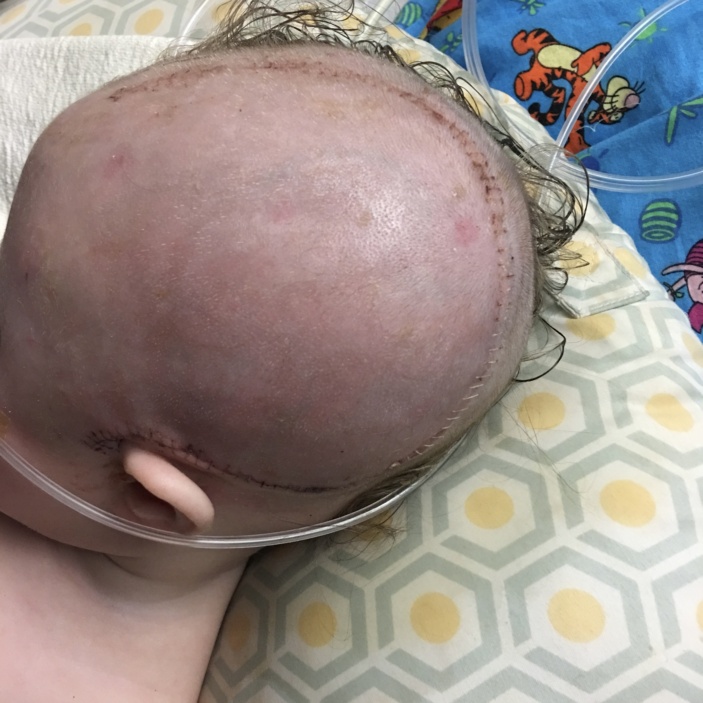
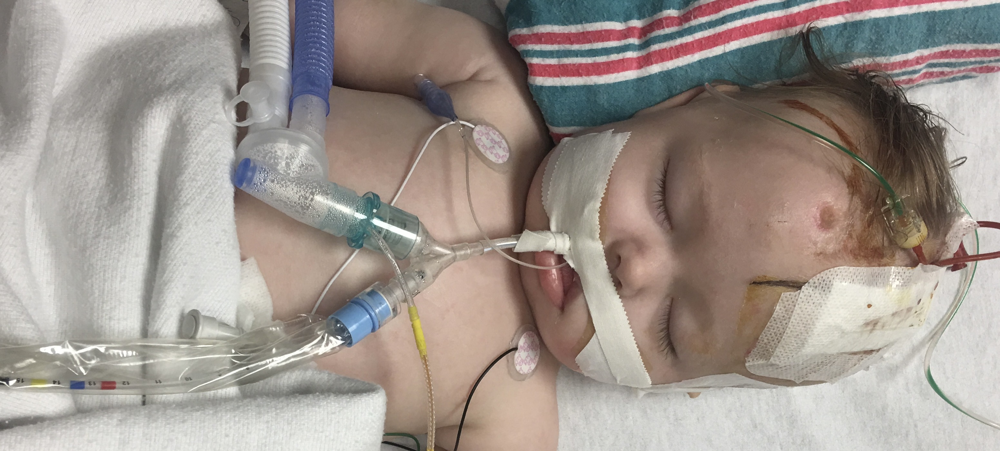
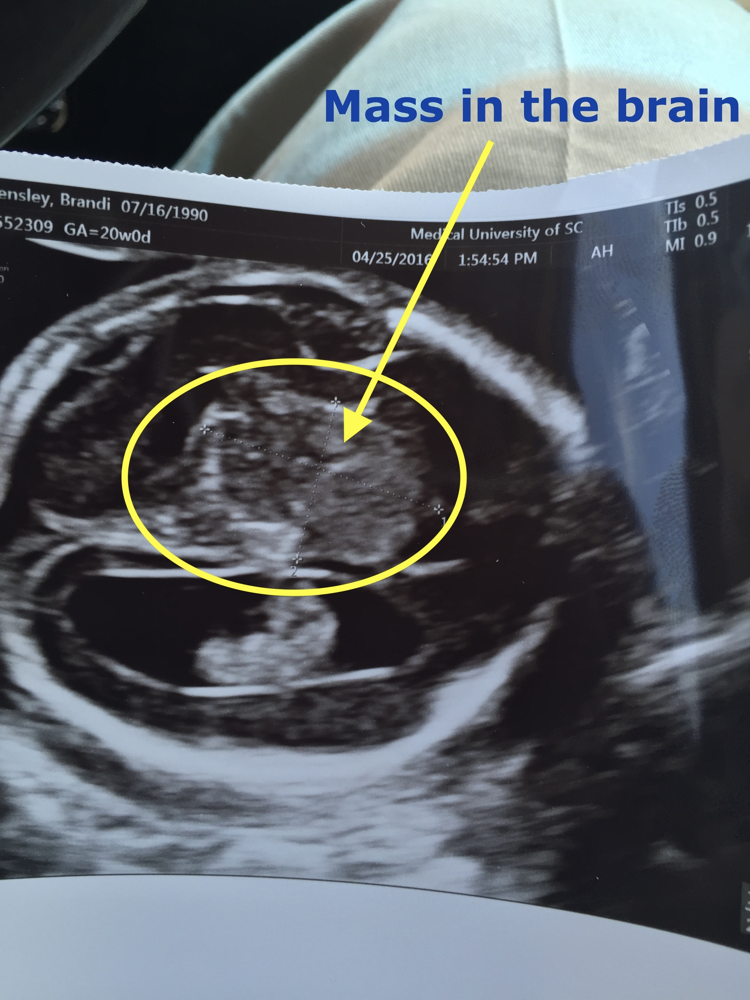

# Transcending the Invisible Enemy: My Lifelong Dedication to Epilepsy Diagnosis

  
  

  
  

Often, life's deepest lessons and motivations sprout from the seeds of our most profound struggles. My inspiration was kindled by my family's unspoken war against epilepsy – a silent enemy veiled within the brain's complex labyrinth, frequently misunderstood, misdiagnosed, and underestimated.

The first casualty in our family was my wife. Her deep frontal lobe seizures eluded conventional EEGs, leading to years of misdiagnosis and even accidental overdose. The resolution, however bitter, was a brain surgery which revealed our true adversary: the incapacity of existing technology to detect "deep brain" seizures.

Our warrior princess, Nicolette, was born into a similar struggle. Initially misdiagnosed with brain cancer at the 20-week anatomy scan, our world was spun into chaos. As it unfolded, we faced a more formidable enemy, a rare and devastating form of epilepsy known as Ohtahara Syndrome.

Ohtahara Syndrome, first identified by the Japanese doctor it is named after in the 1970s, manifests itself within the first few months of a child's life. It's a brutal reality that approximately 60% of infants diagnosed with this syndrome, according to the Epilepsy Foundation, tragically do not live past the age of two. The few who survive beyond this point are often left grappling with significant neurological and developmental issues, resulting in conditions like Lennox-Gastaut Syndrome.

This ruthless syndrome cast a long, despairing shadow over our lives, exacerbating the struggles we faced with Nicolette's misdiagnoses. This was once again due to the inability of conventional EEGs to decipher the unique patterns of Nicolette's brain, forever transformed by a surgery that removed half of it. This technological pitfall left us vulnerable, especially against insurance companies that denied coverage for life-saving medications due to the lack of identifiable patterns in her EEG.

Amidst this sea of frustration, heartache, and desperation, I found a spark of resolve. I yearned to bridge this diagnostic gap, to ensure that no other family had to endure the torment we did. It was this deeply personal motivation that led me to shift my life's trajectory entirely.

Armed with determination and a clear goal, I embarked on a six-year educational journey, navigating through the intricate landscapes of Nonlinear Dynamics, Python programming, and Data Science. I was on a mission to forge a tool capable of decrypting the brain's enigmatic electrical output.

My initial exploration into predicting seizures using Bayesian Inference encountered the unpredictable chaos of neurological data. Yet, this roadblock only solidified my resolve. After further analysis, I discovered a unique "volcano" pattern, a telltale precursor of imminent seizures in EEG data.

Armed with this knowledge, I devised an application that triggers an alarm when this "volcano" pattern emerges, offering families a critical warning of an impending seizure. Still, I was determined to make this solution universal.

I expanded my solution to encompass any patient, even those without prior EEG data. I developed a Python program that processes real-time EEG readings, feeding them into a TensorFlow Deep Learning model capable of identifying an impending seizure at any given moment.

Today, our family's struggle has been transformed into a beacon of hope. Our tribulations have paved the way for a technological breakthrough that may revolutionize epilepsy diagnosis. In the face of adversity, I discovered a life-altering purpose: it drove me to learn, to innovate, and to contribute positively to the world. In the pursuit of this purpose, I unearthed new passions and developed profound expertise in Nonlinear Dynamics, Python, Data Science, and AI – domains that were once foreign to me but are now integral to my existence.

This journey, borne out of personal pain, has not just changed my life, but has the potential to make a significant difference for many others grappling with the enigma of epilepsy.

